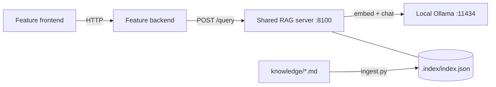

# HOMS Shared RAG Server

Release 1 Retrieval-Augmented Generation server shared by the five HOMS
features. It answers questions **only** from the project knowledge base in
`knowledge/`, returns source citations and a confidence category, and returns
an insufficient-context response instead of guessing when the knowledge base
has nothing relevant.

The server is deliberately non-containerised. Feature backends call it; feature
frontends never call it directly.



## How an answer is produced

1. **Retrieve** — the question is embedded with `nomic-embed-text` and compared
   (cosine similarity) with every chunk from the requested feature's folder
   plus `knowledge/shared/`. The top 4 chunks are kept.
2. **Relevance gate** — chunks scoring below the relevance threshold (0.62) are
   discarded. If none remain, the server returns `insufficient_context`
   **without calling the language model**.
3. **Generate** — `llama3.2:3b` (temperature 0) receives only the relevant
   chunks, labelled `[S1]`, `[S2]`…, and must cite every sentence or reply
   `INSUFFICIENT_CONTEXT` (`prompts/grounded_answer_v1.md`).
4. **Verify** — citations are checked against the sources actually supplied.
   An answer that declines, or cites no supplied source, becomes
   `insufficient_context`. Citations to unknown sources are removed and lower
   the confidence one level.
5. **Confidence** — computed from retrieval evidence, never from the model:

| Category | Rule |
|---|---|
| `high` | Best cited source scores ≥ 0.80 **and** at least two retrieved sources are relevant |
| `medium` | Best cited source scores ≥ 0.70 |
| `low` | Cited sources pass the 0.62 relevance threshold but score below 0.70 |
| `none` | `insufficient_context` responses |

The thresholds were calibrated on the pharmacy knowledge base: answerable
questions scored 0.69–0.87 and off-topic or other-feature questions scored
0.46–0.60. Re-check them with `cli.py retrieve` as teammates add documents.

## Run it

Requires Python 3.12+ and Ollama running locally. From the repository root:

```bash
ollama pull nomic-embed-text           # embeddings (once)
ollama pull llama3.2:3b                # answers (once)
python3 -m pip install -r ai-services/rag-server/requirements.txt
python3 ai-services/rag-server/ingest.py   # build .index/index.json
python3 ai-services/rag-server/server.py   # http://127.0.0.1:8100
```

Re-run `ingest.py` after changing `knowledge/`; the running server reloads the
rebuilt index on its next request, and `/health` reports `"stale": true` until
then. The index is local build output and is not committed.

### Docker access

Loopback-only is the default. For a Docker Compose demo, where feature backend
containers call the server through `host.docker.internal`, run:

```bash
HOMS_RAG_HOST=0.0.0.0 HOMS_RAG_ALLOW_DOCKER_HOST=true \
python3 ai-services/rag-server/server.py
```

Requests must still carry an allowed `Host` header (loopback names, plus
`host.docker.internal:8100` only in this mode), otherwise they get 421. Browser
requests from other origins get 403. A wildcard bind without the explicit flag
is refused at startup. A broad bind is not authentication: use it only on a
trusted network while developing or demonstrating.

## Configuration

| Variable | Default | Purpose |
|---|---|---|
| `HOMS_RAG_HOST` | `127.0.0.1` | Listen interface |
| `HOMS_RAG_PORT` | `8100` | Listen port |
| `HOMS_RAG_ALLOW_DOCKER_HOST` | `false` | Allow `host.docker.internal` (required for a wildcard bind) |
| `OLLAMA_URL` | `http://127.0.0.1:11434` | Local Ollama API |
| `HOMS_RAG_EMBED_MODEL` | `nomic-embed-text` | Embedding model; the index records it and a mismatch is refused |
| `HOMS_RAG_CHAT_MODEL` | `llama3.2:3b` | Answer model |
| `HOMS_RAG_TIMEOUT` | `90` | Seconds per Ollama call |
| `HOMS_RAG_MIN_SCORE` | `0.62` | Relevance threshold |
| `HOMS_RAG_MEDIUM_SCORE` / `HOMS_RAG_HIGH_SCORE` | `0.70` / `0.80` | Confidence boundaries |
| `HOMS_RAG_TOP_K` | `4` | Default chunks retrieved (1–8) |
| `HOMS_RAG_KNOWLEDGE_DIR` / `HOMS_RAG_INDEX_PATH` | `knowledge/`, `.index/index.json` | Locations |

## API contract (schema version 1.0)

All responses are JSON. Errors always use:

```json
{"schema_version": "1.0", "error": {"code": "validation_error", "message": "...", "details": {}}}
```

### `POST /query` — grounded answer

Request (only these fields; anything else is a 400):

```json
{"question": "Who can write off an expired batch?", "feature": "student-3", "top_k": 4}
```

- `question` — required, non-blank, at most 500 characters.
- `feature` — optional; `student-1` … `student-5`. Searches that feature plus
  `shared/`. Omit to search everything.
- `top_k` — optional integer 1–8.

Answered (HTTP 200):

```json
{
  "schema_version": "1.0",
  "status": "answered",
  "question": "Who can write off an expired batch?",
  "feature": "student-3",
  "answer": "According to [S1], only a Pharmacy Manager can write off a batch, and a reason is required.",
  "confidence": "high",
  "citations": [{
    "id": "S1",
    "source": "student-3/expiry-and-write-off.md",
    "title": "Batch Expiry and Write-Off",
    "section": "Writing off a batch",
    "score": 0.842,
    "snippet": "Writing off removes a batch's remaining stock, usually because it has expired…"
  }],
  "reason": null,
  "retrieval": {"top_score": 0.842, "threshold": 0.62, "considered": 4, "relevant": 4},
  "models": {"embedding": "nomic-embed-text", "generation": "llama3.2:3b"},
  "duration_ms": 2323
}
```

Insufficient context (also HTTP 200 — it is a valid, expected outcome):

```json
{
  "schema_version": "1.0",
  "status": "insufficient_context",
  "answer": "The knowledge base does not contain enough relevant information to answer this question, so no answer was generated.",
  "confidence": "none",
  "citations": [],
  "reason": "no_relevant_context",
  "retrieval": {"top_score": 0.5982, "threshold": 0.62, "considered": 4, "relevant": 0},
  "...": "question, feature, models and duration_ms as above"
}
```

`reason` is `no_relevant_context` (relevance gate), `model_declined` (model
replied `INSUFFICIENT_CONTEXT`) or `uncited_answer` (no valid citation). On an
answered response it is `null`, or `invalid_citations_removed`.

### `POST /retrieve` — retrieval evidence only

Same request as `/query`. Returns ranked chunks with `score`, `relevant`,
`source`, `section` and `snippet`; never calls the answer model.

### `GET /sources?feature=student-3`

Lists indexed documents with their sections and chunk counts (`feature` may
also be `shared`, or omitted for all).

### `GET /health`

200 with `"status": "ok"` when the index is loaded and both Ollama models are
installed; otherwise 503 with `"status": "degraded"` and the reason in `index`
or `ollama`. Also reports thresholds and whether the index is stale.

### Error codes

| HTTP | `code` | Meaning |
|---|---|---|
| 400 | `validation_error` | Bad JSON body, unexpected field, bad question/feature/top_k |
| 413 | `validation_error` | Body over 4 KB |
| 421 | `host_not_allowed` | Host header not permitted |
| 403 | `origin_not_allowed` | Cross-site browser origin |
| 503 | `index_missing` / `index_invalid` / `index_model_mismatch` | Run `ingest.py` |
| 503 | `ollama_unavailable` / `model_unavailable` / `ollama_error` | Start Ollama / pull the model |
| 504 | `ollama_timeout` | Ollama did not answer within `HOMS_RAG_TIMEOUT` |

## Connecting a feature (integration pattern)

Follow the same pattern as MCP access:

1. Backend configuration: `RAG_ENABLED` (default `false`) and `RAG_SERVER_URL`
   (default `http://127.0.0.1:8100`).
2. Backend endpoint (for example `POST /api/rag/ask`) that validates the
   question, sends `{"question": ..., "feature": "student-N"}` to `/query`, and
   returns the JSON to the frontend. When disabled, return 503 without calling
   the server.
3. Frontend panel that shows the answer, each citation (source › section,
   snippet) and a confidence badge, and shows the insufficient-context message
   as its own clear state.
4. `docker-compose.yml`: `RAG_ENABLED: "true"`,
   `RAG_SERVER_URL: http://host.docker.internal:8100` and
   `extra_hosts: ["host.docker.internal:host-gateway"]` on the backend.
5. CI workflow: `RAG_ENABLED=false`, plus a check that the backend reports RAG
   as disabled. The RAG server is never started in CI.

Add your feature's documents to `knowledge/student-N/` (see the README there),
then run `ingest.py`.

## Terminal validation

With the server running:

```bash
bash ai-services/rag-server/validate.sh          # health, sources, retrieval, 4 answered + 3 insufficient-context checks
python3 ai-services/rag-server/cli.py query "When is stock low?" --feature student-3
python3 ai-services/rag-server/cli.py retrieve "When is stock low?" --feature student-3
```

`cli.py query --expect answered|insufficient_context` exits 1 when the status
differs, so it can be scripted. Each request is also logged by the server, for
example `[RAG] query feature=student-3 status=answered confidence=high ...`.
Latest captured output: `docs/ai-evidence/rag-server/terminal-validation.txt`.

## Tests

```bash
python3 -m pip install pytest
python3 -m pytest -q ai-services/rag-server/tests
```

Ollama is replaced by a deterministic fake, so tests need no models. They cover
chunking, ingestion and staleness, feature scoping, the relevance gate (the
model is not called), declined/uncited/invalid citations, the confidence
rules, input validation, error mapping, and the host/origin/Docker access
rules.

## Knowledge base

| Folder | Owner | Status |
|---|---|---|
| `knowledge/shared/` | Group | HOMS overview: features, architecture, ports, AI services |
| `knowledge/student-3/` | Student 3 | 5 pharmacy documents (inventory, issuing/receiving, expiry/write-off, reordering/POs, AI/agent) |
| `knowledge/student-1/`, `-2/`, `-4/`, `-5/` | Each student | Awaiting documents — see each folder's README |

## Limitations

- Retrieval is an in-memory linear scan: fine for hundreds of chunks, not for
  large corpora.
- A 3B model can occasionally phrase answers loosely; citation checks and the
  relevance gate limit, but do not eliminate, this risk.
- The first query after Ollama starts is slow (model load, ~15 s); later
  queries take about 0.5–5 s.
- There is no authentication; access is limited to the local host (and Docker
  host when explicitly enabled).
