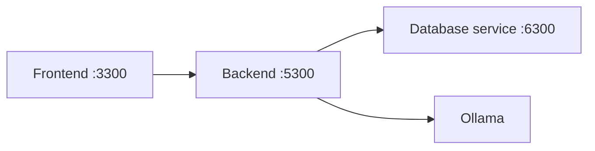

# Student 3 backend

This Flask service listens on **5300**, calls the Student 3 database service on 6300, and holds the pharmacy business logic. It never opens SQLite directly; inventory, purchase orders, FEFO, dashboard aggregation, AI advice, and the scheduled proposal agent are implemented here.

## Run

`docker compose up -d --build student-3-backend` from the repository root.

Standalone: `cd student-3/backend && DATABASE_SERVICE_URL=http://localhost:6300 python app.py`.
Tests: `python -m unittest discover -s student-3/backend/tests -v`.

| Variable | Default |
|---|---|
| `PORT` / `BACKEND_PORT` | `5300` |
| `DATABASE_URL` / `DATABASE_SERVICE_URL` | `http://localhost:6300` |
| `OLLAMA_URL`, `OLLAMA_MODEL`, `OLLAMA_TIMEOUT` | `http://ollama:11434`, `llama3.2:3b`, `90` seconds |
| `AGENT_ENABLED`, `AGENT_INTERVAL_SECONDS`, `AGENT_MAX_PROPOSALS`, `AGENT_BUDGET_CAP` | `true`, `300`, `3`, `500.00` |

## Endpoints

| Area | Paths |
|---|---|
| Health/agent/dashboard | `GET /health`, `/api/agent/status`, `/api/dashboard/summary` |
| AI | `GET /api/ai/health`; `POST /api/ai/expiry-advisory`, `/api/ai/suggest-reorder`, `/api/ai/suggest-reorder/create-drafts` |
| Staff/suppliers/medicines | `GET /api/staff[/<id>]`; supplier CRUD/reactivate; medicine CRUD/reactivate |
| Stock/batches | `GET /api/stock/movements`, `/api/batches`; `POST /api/stock/issue`, `/api/stock/receive`, `/api/batches/<id>/write-off` |
| Purchase orders | list/detail/open, create/update, and approve/reject/mark-ordered/cancel actions under `/api/purchase-orders` |

## Inventory and AI

Issuing uses FEFO: non-expired non-empty batches are consumed by nearest expiry, splitting an issue over batches when needed. Receiving creates a batch and movement, and write-off creates a waste movement; both recalculate medicine stock through database-service calls.

Expiry and reorder advisories use Ollama. The backend owns quantities, usage rates, dates, values, and calculated order quantities; the model may only classify priority/action and explain supplied facts. Invalid/unavailable model output falls back per item to deterministic rules, and responses label `source` as `ai` or `fallback`.

Prompts: `expiry_advisory_v2` contains an earlier full-record contract; `v3` narrowed model output to action/priority/reasoning so backend facts cannot be changed. `reorder_recommendation_v1` is the manual advisory contract; `v2` adds recent human rejection/edit context for the scheduled agent. `smoke_v1` is a JSON connectivity probe.

The scheduled agent runs Plan → Act → Observe → Adapt: it gathers candidates, obtains bounded advisory reasoning, checks duplicates/budget/expiry/normal-use rules, then creates only `pending_approval` proposals. Before the next cycle it reads the ten most recent rejected or edited AI orders as feedback. It never approves, orders, receives, issues, or dispenses stock.

## Known issues and limitations

The agent is designed for one backend process; multiple replicas need database-side uniqueness/locking. Incoming orders do not carry a shelf-life field, so its expiry check uses a logged 90-day planning assumption. Calls between backend and database service are not cross-service transactions.
