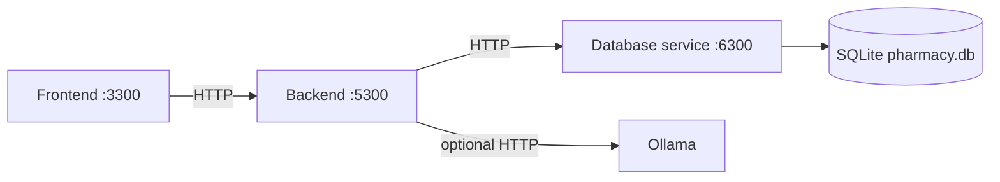

# Student 3 Backend Service

Business-logic API for Pharmacy & Medication Inventory Management. It validates inventory operations, produces advisories and draft orders, and never opens SQLite directly. **Port: 5300.**

## Prerequisites

Before running locally or with Docker, install Ollama and pull the configured model:

```bash
ollama pull llama3.2:3b
ollama list        # confirm llama3.2:3b is listed
```

Without the model, AI advisories use intentional `SOURCE: FALLBACK` rule-based suggestions while the application continues to work. Only AI reasoning is unavailable; this is graceful degradation, not a failure.

## Role in the architecture



The frontend never calls 6300 or touches the `.db` file. This backend calls the database service for pharmacy data and is the only Student-3 service holding business logic. It must never read the `.db` file directly; Ollama is advisory-only.

## Tech stack

| Component | Version / use |
|---|---|
| Python | Python 3; Docker image uses 3.12-slim |
| Flask | 3.0.3 |
| HTTP client | Python standard-library `urllib` |
| AI runtime | Ollama, default `llama3.2:3b` |

## Folder structure

```text
backend/
├── app.py                    # API, validation, workflows, dashboard
├── services/
│   ├── ai_client.py           # Bounded Ollama JSON client and prompt loader
│   ├── expiry_advisory.py     # Expiry calculations and fallbacks
│   ├── reorder_recommendation.py # Reorder calculations and fallbacks
│   └── scheduled_agent.py     # Plan → Act → Observe → Adapt worker
├── prompts/                   # Immutable versioned prompts
├── AGENT.md                   # Agent operating constraints
├── ai_smoke.py                # Ollama connectivity smoke script
├── tests/                     # Mocked database and workflow tests
├── requirements.txt           # Flask dependency
├── Dockerfile                 # Port-5300 image
└── README.md                  # This document
```

## Running locally

Run this from the repository root after starting the database. All three services need separate terminals and must start **database → backend → frontend**.

```bash
cd student-3/backend && pip install -r requirements.txt && python3 app.py
```

The default database address is `http://localhost:6300`. Ollama is not required for ordinary inventory work: advisory calls have a fallback path.

## Running with Docker

```bash
docker compose up -d --build
docker compose logs -f student-3-backend
docker compose stop student-3-backend
```

Compose waits for database health, uses `http://student-3-database:6300` on `homs-net`, and reaches the shared Compose Ollama service at `http://ollama:11434`.

## Configuration

| Variable | Default | Required | Purpose |
|---|---|---|---|
| `PORT` / `BACKEND_PORT` | `5300` | No | Listen port; `PORT` wins. |
| `DATABASE_URL` / `DATABASE_SERVICE_URL` | `http://localhost:6300` | No | Database-service base URL; first name wins. |
| `OLLAMA_URL` | `http://ollama:11434` | No | Ollama API base URL. |
| `OLLAMA_MODEL` | `llama3.2:3b` | No | Model submitted to Ollama. |
| `OLLAMA_TIMEOUT` | `90` seconds | No | Bound per model call; invalid input reverts to 90. |
| `AGENT_ENABLED` | `true` | No | Starts background draft-proposal cycles. |
| `AGENT_INTERVAL_SECONDS` | `300` | No | Delay between cycles; invalid/low values become 300. |
| `AGENT_MAX_PROPOSALS` | `3` | No | Maximum created per cycle. |
| `AGENT_BUDGET_CAP` | `500.00` | No | Maximum proposed dollar value per cycle. |

## API reference

Manager-changing routes require `X-HOMS-Role: Pharmacy Manager`.

| Method | Path | Purpose |
|---|---|---|
| GET | `/health` | Backend health. |
| GET | `/api/dashboard/summary` | Five bulk reads for dashboard data and agent state. |
| GET | `/api/agent/status` | Agent status. |
| GET | `/api/ai/health` | Non-crashing Ollama reachability check. |
| POST | `/api/ai/expiry-advisory` | Read-only AI/fallback expiry advice. |
| POST | `/api/ai/suggest-reorder` | Read-only AI/fallback reorder advice. |
| POST | `/api/ai/suggest-reorder/create-drafts` | Create manager-selected pending drafts. |
| GET | `/api/staff`, `/api/staff/{id}` | Demo identity data. |
| GET, POST | `/api/suppliers` | List or create supplier. |
| GET, PUT, DELETE | `/api/suppliers/{id}` | Detail, edit, discontinue. |
| POST | `/api/suppliers/{id}/reactivate` | Restore supplier. |
| GET, POST | `/api/medicines` | List enriched medicines or create. |
| GET, PUT, DELETE | `/api/medicines/{id}` | Detail, edit, discontinue. |
| POST | `/api/medicines/{id}/reactivate` | Restore medicine. |
| GET | `/api/stock/movements` | Filtered history and summary. |
| GET | `/api/batches` | Filtered batches and expiry summary. |
| POST | `/api/batches/{id}/write-off` | Manager write-off and waste movement. |
| POST | `/api/stock/issue` | Manager FEFO issue. |
| POST | `/api/stock/receive` | Manager delivery receipt. |
| GET, POST | `/api/purchase-orders` | List enriched orders or create. |
| GET | `/api/purchase-orders/open` | Open orders for one medicine. |
| GET, PUT | `/api/purchase-orders/{id}` | Detail or manager edit. |
| POST | `/api/purchase-orders/{id}/approve`, `/reject`, `/mark-ordered`, `/cancel` | Workflow transitions. |

Observed health request and response:

```http
GET /health
```

```json
{"service":"student-3-backend","status":"ok"}
```

```http
POST /api/stock/issue
X-HOMS-Role: Pharmacy Manager
Content-Type: application/json

{"medicine_id":1,"quantity":12,"reason":"Ward issue"}
```

The issue response reports `medicine_id`, `quantity_issued`, and the actual
per-batch `allocations`. Dashboard summary returns `counts`, `low_stock`,
`expiring_soon`, `recent_movements`, and `agent`; all values depend on the
current database state.

## Inventory workflows

### FEFO issuing

The backend sorts non-expired batches by expiry date, rejects an issue larger than total available stock, updates batch and medicine quantities, then appends an `issue` movement. For a request of 12 units with batch A (earliest expiry, 8 units) and B (20), it takes 8 from A then 4 from B.

### Delivery receipt and write-off

Receiving creates or updates a batch, increases `quantity_received` and `quantity_remaining`, increments medicine stock, appends a `receive` movement, and updates an associated order when supplied. Write-off requires a manager, makes batch remaining quantity zero, decreases medicine stock, and appends a `waste` movement.

## AI advisories

Ollama is advisory-only. The service requires JSON matching each prompt's schema; malformed output is retried once and then falls back. **The backend owns the numbers; the model owns the judgement**: IDs, quantities, dates, rates, values, and suggested reorder quantity come from data and are never accepted from the model.

Expiry responses contain one judgement per batch: `recommended_action`, `priority`, and `reasoning`. Reorder responses contain `priority`, `reasoning`, `adjustment_flag`, and `adjustment_reason`. A usable model reply has `"source":"ai"`; timeout, unavailable Ollama, malformed JSON, or invalid item responses are deterministic per-item/full fallbacks with `"source":"fallback"`. Medicines with an open purchase order are excluded from reorder candidates.

| Prompt | Implemented change / reason |
|---|---|
| `smoke_v1.md` | Fixed JSON-only connectivity check. |
| `expiry_advisory_v1.md` | Original expiry/waste judgement contract. |
| `expiry_advisory_v2.md` | Exact response shape and shorter reasoning for completion time. |
| `expiry_advisory_v3.md` | Limits model output to judgement fields, protecting calculated facts. |
| `reorder_recommendation_v1.md` | Original calculated-quantity reorder contract. |
| `reorder_recommendation_v2.md` | Adds recent human decisions to avoid repeated rejected proposals. |

## Scheduled agent

When enabled, app startup starts a daemon thread. It never approves, orders, issues, or dispenses stock. It writes only `pending_approval` purchase orders with `ai_generated=1`, `ai_reasoning`, and `created_by='agent'`.

| Stage | Implemented behaviour |
|---|---|
| Plan | Bulk-reads stock, 30-day usage, lead times, open orders, and near-expiry stock; logs candidate count. |
| Act | Reuses reorder logic for reasoned drafts, using Ollama or rule fallback. |
| Observe | Logs/rejects duplicate proposals, budget breaches, likely-expiry quantities, and quantities wildly above normal usage. |
| Adapt | Reads the ten latest AI-generated rejected/edited orders and decision reasons into the next v2 reorder prompt. |

Every cycle logs a UTC timestamp and number. A cycle failure is logged without killing the thread. Pending proposals suppress duplicates; a later rejected/edited decision can affect a new suggestion.

## Running the tests

```bash
cd student-3/backend && python3 -m unittest discover -s tests -v
```

Tests mock every database-service call, never using port 6300. They cover CRUD validation, FEFO, receipt/write-off, AI source/fallback behaviour, dashboard bulk reads, and agent duplicate/adaptation behaviour. The current suite passes **23 tests**.

## Troubleshooting

| Problem | Fix |
|---|---|
| `Database service unavailable` | Start 6300 first or set `DATABASE_URL`. |
| Advisory is slow | Set a numeric `OLLAMA_TIMEOUT`; fallback returns after timeout. |
| `Pharmacy Manager role required` | Include `X-HOMS-Role: Pharmacy Manager`. |
| Agent logs fallback | Start Ollama if AI judgement is needed; rule proposals still run. |

## Known issues and limitations

- The role header is demonstration-only and is not shared authentication.
- The agent is a process-local daemon thread, not a durable multi-worker scheduler.
- Ollama can be slow; advisory endpoints deliberately use bounded calls and fallback.
