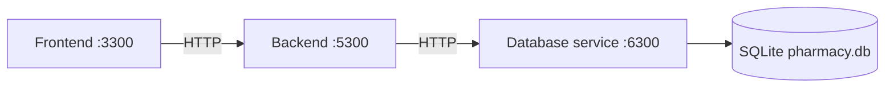

# Student 3 Frontend Service

Server-rendered Pharmacy & Medication Inventory Management interface. Flask renders HTML and HTMX refreshes page fragments; this is not a single-page application. **Port: 3300.**

## Role in the architecture



The frontend calls port 5300 only. It never calls 6300 and never touches the `.db` file; the backend also never touches that file directly. The frontend never calls Ollama.

## Tech stack

| Component | Version / use |
|---|---|
| Python | Python 3; Docker image uses 3.12-slim |
| Flask | 3.0.3 |
| HTMX | Template-loaded browser partial updates |
| Jinja / HTML | Server-rendered pages and partials |
| HTTP client | Python standard-library `urllib` |

## Folder structure

```text
frontend/
├── app.py                   # Routes, demo identity, rendering, CSV exports
├── api_client.py            # Only frontend-to-backend HTTP boundary
├── templates/               # Full pages and HTMX partial templates
├── static/
│   ├── css/                 # Local Student-3 styling files
│   └── js/ai-loading.js     # Advisory loading state
├── tests/                   # Mocked backend route and panel tests
├── requirements.txt         # Flask dependency
├── Dockerfile               # Port-3300 image; copies shared frontend assets
└── README.md                # This document
```

The image copies `shared/frontend/` and serves it under `/shared/`. Current code also has local CSS under `static/css/`, so it would be inaccurate to claim there is no local CSS; templates use both shared HOMS assets and Student-3 styles.

## Running locally

Run this from the repository root. Database, backend, and frontend must run in three separate terminals in the order **database → backend → frontend**.

```bash
cd student-3/frontend && pip install -r requirements.txt && python3 app.py
```

Open <http://localhost:3300>. The default backend is `http://localhost:5300`.

## Running with Docker

```bash
docker compose up -d --build
docker compose logs -f student-3-frontend
docker compose stop student-3-frontend
```

Compose waits for backend health and uses `http://student-3-backend:5300` on `homs-net`.

## Configuration

| Variable | Default | Required | Purpose |
|---|---|---|---|
| `PORT` / `FRONTEND_PORT` | `3300` | No | Listen port; `PORT` wins. |
| `BACKEND_API_URL` | `http://localhost:5300` | No | The only service base URL used. |
| `BACKEND_API_TIMEOUT` | `120` seconds | No | Timeout used for AI advisory calls; invalid input reverts to 120. |
| `FLASK_SECRET_KEY` | Random per process | No | Signs the demo-role session cookie. |

`BACKEND_API_TIMEOUT` is 120 seconds because an Ollama-backed backend advisory can take longer than ordinary CRUD. `api_client` turns timeout and connection failures into `BackendError`, and page routes render their error state instead of failing with a 500.

## Pages

| Route | What it does |
|---|---|
| `/demo` | Select simulated role and staff identity. |
| `/` | Live inventory dashboard: stock/expiry counts, movements, agent strip. |
| `/medicines` | Filter/view medicines; manager maintenance, issue/receive, CSV export. |
| `/batches` | Filter batches, view expiry, request advice, manager write-off, export. |
| `/movements` | Filter and export append-only stock history. |
| `/suppliers` | Filter/view suppliers; manager maintenance and export. |
| `/purchase-orders` | Filter/export orders, view detail, advice, human review, agent panel. |
| `/health` | Frontend health response. |

HTMX routes such as `/medicines/table`, `/batches/table`, `/purchase-orders/table`, form/detail routes, and advisory panel routes render partial templates for their associated pages.

## Demo roles and access

The demo role switcher calls backend staff endpoints and records a selected identity in the Flask session. It provides `Pharmacy Manager` (database role `manager`) and `Pharmacist` (database role `staff`). This is demonstration identity, not shared authentication.

Manager-only controls are medicine/supplier create, edit, discontinue and reactivate; stock issue and receipt; batch write-off; reorder-draft creation; agent-proposal edit; and purchase-order approve, reject, mark-ordered, and cancel. Pharmacists can view, filter, export, and request read-only advice; manager controls are absent and protected actions return 403.

## API reference

Browser-facing routes above return HTML. `api_client.py` is the only API client and calls backend port 5300:

| Backend method | Path | Frontend use |
|---|---|---|
| GET | `/api/dashboard/summary`, `/api/agent/status` | Dashboard and agent panel. |
| GET, POST, PUT, DELETE | `/api/medicines`, `/api/medicines/{id}` | Medicines and manager forms. |
| GET, POST, PUT, DELETE | `/api/suppliers`, `/api/suppliers/{id}` | Supplier pages. |
| GET | `/api/batches`, `/api/stock/movements` | Batch and movement pages. |
| POST | `/api/stock/issue`, `/api/stock/receive`, `/api/batches/{id}/write-off` | Inventory actions. |
| GET, POST, PUT | `/api/purchase-orders` and order detail/action paths | Approval workflow. |
| POST | `/api/ai/expiry-advisory`, `/api/ai/suggest-reorder` | Read-only advice. |

For example, an issued-medicine form causes this backend JSON request:

```json
{"medicine_id":1,"quantity":"12","reason":"Ward issue"}
```

The backend result is rendered into the relevant HTML panel rather than exposed as a separate frontend JSON API.

Observed health request and response:

```http
GET /health
```

```json
{"service":"student-3-frontend","status":"ok"}
```

## Running the tests

```bash
cd student-3/frontend && python3 -m unittest discover -s tests -v
```

Tests mock `api_client`, so they never use a live backend on port 5300. They cover rendering routes, dashboard data, manager gates, agent panel output, and timeout/connection-error display. The current suite passes **9 tests**.

## Troubleshooting

| Problem | Fix |
|---|---|
| Redirected to `/demo` | Choose a role and staff member to initialise the demo session. |
| Backend unavailable error state | Start backend after database or correct `BACKEND_API_URL`. |
| Advisory timeout | Backend falls back safely if Ollama is slow/unavailable; inspect backend configuration if AI judgement is needed. |
| Manager control missing | Enter through `/demo` as `Pharmacy Manager`. |

## Known issues and limitations

- The role switcher is not a production authentication/authorisation system.
- Synchronous server-side backend calls delay the relevant page response until timeout.
- Shared frontend assets are used, but local Student-3 CSS files also exist.
