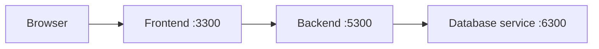

# Student 3 frontend

This Flask + HTMX application listens on **3300** and renders Pharmacy & Medication Inventory Management pages. It calls the backend on 5300 only: it never calls 6300 or reads the SQLite file.

## Run

`docker compose up -d --build student-3-frontend` from the repository root.

Standalone: `cd student-3/frontend && BACKEND_API_URL=http://localhost:5300 python app.py`.
Tests: `python -m unittest discover -s student-3/frontend/tests -v`.

| Variable | Default | Purpose |
|---|---|---|
| `PORT` / `FRONTEND_PORT` | `3300` | Flask listener |
| `BACKEND_API_URL` | `http://localhost:5300` | only service dependency |
| `BACKEND_API_TIMEOUT` | `120` seconds | allows local Ollama advisory requests to finish through the backend |
| `FLASK_SECRET_KEY` | random per process | demo-role session signing |

Shared CSS and browser assets are served from `shared/frontend`; this frontend has no local static CSS.

## Pages

| Page | Function |
|---|---|
| Dashboard | live inventory summary, expiry, movements, and agent status |
| Medicines | filter medicines, detail, stock issue/receive, manager maintenance |
| Batches & Expiry | expiry filters, batch data, write-off, expiry advisory |
| Stock Movements | filtered ledger, summary, CSV export |
| Purchase Orders | filters, AI reorder suggestions, approval queue, order detail/export |
| Suppliers | filter/detail, manager supplier maintenance, CSV export |
| Demo | selects a seeded manager or pharmacist identity |

The role switcher stores a simulated identity in the Flask session. Pharmacy Managers can add/edit/deactivate/reactivate medicines and suppliers, issue/receive/write off stock, create/review AI reorder drafts, and approve or transition purchase orders. Pharmacists can view operational pages and advisory results but do not see those controls.

## Known issues and limitations

The identity switcher is demonstration-only authentication, not access control for a production deployment. Pages depend on the backend being reachable; failures render error states. HTMX updates use ordinary server-rendered partials and there is no client-side offline cache.
